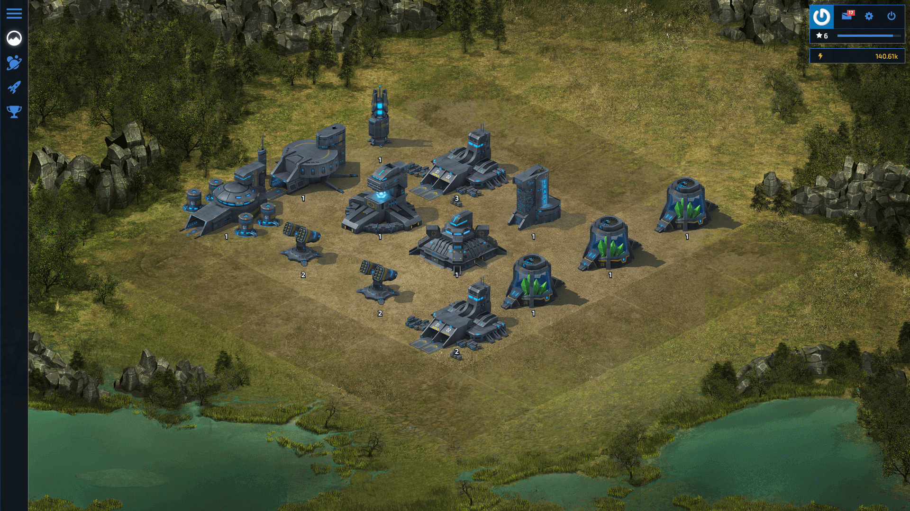

# Galaxy of Drones Online

An open source multiplayer space strategy game.

**Screenshots:** https://koodilab.com/

## About the game

The game story takes place in a virtual galaxy where randomly generated planets produce various raw materials which can be used by the Players to develop their infrastructure and fleet. In addition, players may trade with the Earth or engage in battles, so beyond various military arrangements, economic decisions should be taken as well.

## Documentation

The initial documentation is available [on GitHub](https://github.com/galaxyofdrones/docs).

The roadmap is available [on Trello](https://trello.com/b/vWfdm6AA/galaxy-of-drones-online).

## Security

If you discover a security vulnerability within Galaxy of Drones Online, please send an e-mail to Koodilab at support@koodilab.com. All security vulnerabilities will be promptly addressed.

## License

The Galaxy of Drones Online is open-sourced software licensed under the [MIT license](http://opensource.org/licenses/MIT).

The Artwork is licensed under the [CC BY-NC-SA 4.0](https://creativecommons.org/licenses/by-nc-sa/4.0/).
